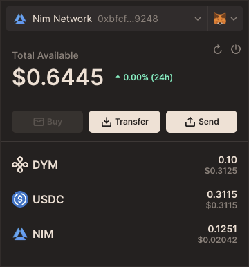

# Dymension Connect
<p align="center">
  
</p>

## Overview
The Dymension Connect Widget allows RollApps to easily integrate wallet connection functionality into their applications, 
facilitating user interactions with blockchain accounts. 
Designed to be framework-agnostic, this widget can be seamlessly incorporated into projects built with React, Vue, Angular, or vanilla JavaScript.

## Usage
To integrate the Dymension Connect Widget into your application, follow these steps:

### Step 1: Define Environment and Network
Specify the connection URL and network ID for your widget instance. These should match the blockchain network your application interacts with.
```javascript
const DYMENSION_CONNECT_URL = 'https://portal.dymension.xyz';
const DYMENSION_CONNECT_NETWORK_IDS = ['dymension_1100-1'];
const DYMENSION_CONNECT_NETWORK_MAIN_DENOM = 'adym'
```

### Step 2: Embed the Widget
Embed the Dymension Connect Widget into your application using an iframe. This setup enables your users to interact with the widget directly from your UI.
```jsx
<iframe
  ref={iframeRef}
  onLoad={initModal}
  style={{display: dymensionConnectOpen ? 'block' : 'none'}}
  allow='clipboard-read; clipboard-write; camera'
  title='dymension-connect'
  className='dymension-connect-iframe'
  src={`${DYMENSION_CONNECT_URL}/connect?networkIds=${DYMENSION_CONNECT_NETWORK_IDS.join(',')}`}
/>
```

### Step 3: Passing a `qrAccount` for Quick-Auth Connections
If your application receives a `qrAccount` query parameter from the URL (when a user scans a Quick-Auth QR code), you can pass this value to the Dymension Connect Widget so it can automatically initiate a Quick-Auth connection. Here’s how you might retrieve the `qrAccount` and include it in the iframe's `src`:
```jsx
const qrAccount = useMemo(() => new URLSearchParams(window.location.search).get('qrAccount'), []);

<iframe
  ref={iframeRef}
  onLoad={initModal}
  style={{display: dymensionConnectOpen || qrAccount ? 'block' : 'none'}}
  allow='clipboard-read; clipboard-write; camera'
  title='dymension-connect'
  className='dymension-connect-iframe'
  src={`${DYMENSION_CONNECT_URL}/connect${qrAccount ? `/account/${qrAccount}` : ''}?networkIds=${DYMENSION_CONNECT_NETWORK_IDS.join(',')}`}
/>
```
When the widget detects qrAccount, it will prompt the user for their PIN code and automatically connect to the specified account. This provides a seamless login flow, especially for QR-based interactions.

### Step 4: Communicate with the Widget
Maximize the utility and adaptability of the Dymension Connect Widget within your application by leveraging direct messaging. 
This advanced method enables real-time communication with the widget's iframe, allowing you to dynamically adjust its appearance and behavior to suit user interactions and your application's styling needs. 
Utilize the postMessage API to send messages from your application to the widget, enhancing user experience through customization and control.
```javascript
const sendMessage = useCallback((message) => {
    iframeRef.current?.contentWindow?.postMessage(message, DYMENSION_CONNECT_URL);
}, []);

sendMessage({
    type: 'setStyles',
    styles: {
        '--black-light': 'rgb(63 81 59)',
        '--black-light-rgb': '63, 81, 59',
        '--black-dark': 'rgb(27 40 24)',
        '--black-dark-rgb': '27, 40, 24',
        '--background-color': 'rgb(42 59 42)',
        '--background-color-secondary': 'rgb(63 78 63)'
    }
});
sendMessage({type: 'setMenuAlign', align: 'center'});
```
#### Optional messages that can be sent to the widget:
- **`setTriggerBoundingRect`**: Adjusts the widget's position by specifying the trigger element's bounding rectangle.
    ```javascript
    sendMessage({ type: 'setTriggerBoundingRect', rect: /* DOMRect object */ });
    ```
- **`setStyles`**: Modifies the widget's styles to better match your application's theme.
    ```javascript
    sendMessage({
        type: 'setStyles',
        styles: {
            '--control-color-normal': 'yourValue',
            '--background-color': 'yourValue',
            '--background-color-secondary': 'yourValue',
            // Add more custom style properties as needed
        }
    });
- **`setMenuAlign`**: Alters the alignment of the widget's menu relative to the trigger element, enhancing layout consistency and visual harmony.
    ```javascript
    sendMessage({ type: 'setMenuAlign', align: 'center' /* Or 'left', 'right' */ });
    ```

- **`connect`** (supports Keplr, MetaMask and Leap): Triggers a direct connection to a specified wallet type without opening the widget’s default UI flow. Passing `undefined` as the wallet type will disconnect the currently connected wallet.
    ```javascript
    const connectWallet = useCallback((walletType) => {
      sendMessage({
        type: 'connect',
        networkId: DYMENSION_CONNECT_NETWORK_IDS[0], 
        walletType, // one of 'Keplr', 'MetaMask', 'Leap'
      });
    }, [sendMessage]);
    ```

- **`executeTx`**: You can send a transaction to the connected wallet using the `executeTx` message.:
    ```javascript
    const sendTokens = useCallback(() => {
      sendMessage({
        type: 'executeTx',
        messages: [{
          typeUrl: '/cosmos.bank.v1beta1.MsgSend',
          value: { fromAddress, toAddress, amount }
        }]
      });
    }, [address]);
    ```
  
### Step 5: Listen for Messages from the Widget
To create a fully interactive experience, your application should listen for messages from the Dymension Connect Widget. 
This allows your app to react to user actions within the widget, such as connecting or disconnecting a wallet. 
Implement the listener within a `useEffect` to handle these messages appropriately:
```javascript
useEffect(() => {
  const handleMessage = (event) => {
    if (event.origin !== DYMENSION_CONNECT_URL) {
      return;
    }
    if (event.data.type === 'ready') {
      setDymensionConnectReady(true);
    }
    if (event.data.type === 'menu-visible') {
      setDymensionConnectOpen(event.data.value);
    }
    if (event.data.type === 'connect') {
      setHexAddress(event.data.hexAddress);
      setAddress(event.data.address);
      updateTriggerBoundingRect();
    }
    if (event.data.type === 'disconnect') {
      setHexAddress('');
      setAddress('');
      updateTriggerBoundingRect();
    }
    if (event.data.type === 'tx-response') {
      setBroadcasting(false);
      console.log(event.data.response || event.data.error);
    }
    if (event.data.type === 'notification') {
      console.log(event.data.messages);
    }
    if (event.data.type === 'wallet-error') {
      console.log(event.data.error);
    }
  }
  window.addEventListener('message', handleMessage);
  return () => window.removeEventListener('message', handleMessage);
}, [initModal, sendMessage, updateTriggerBoundingRect]);
```

#### Optional messages that can be received from the widget:
- **`ready`**: Indicates the widget has fully loaded and is ready for user interaction.
- **`menu-visible`**: Tells you whether the widget’s menu is visible. The `value` property (`true` or `false`) reflects the menu’s state. You can use this to show or hide other UI elements accordingly.
- **`connect`**: Notifies that a user has successfully connected their wallet. This message includes both the Bech32 address (`event.data.address`) and the Hex address (`event.data.hexAddress`), enabling you to update your UI or trigger further actions.
- **`disconnect`**: Indicates the user has disconnected their wallet. Use this message to clear user data from your UI or revert to a default state.
- **`tx-response`**: Returns the outcome of a transaction broadcast that you initiated with the `executeTx` message. The response may contain details of the successfully broadcasted transaction (`event.data.response`) or an error message (`event.data.error`).
- **`notification`**: Passes along any notification messages from the widget (`event.data.messages`). You can log or display these notifications in your UI as needed.
- **`wallet-error`**: Notifies your application of an error that occurred during a wallet connection attempt. You can handle these errors by displaying a user-friendly message, logging for debugging, etc.

Listening for these messages and implementing corresponding actions in your application ensures a seamless and responsive experience for users interacting with the Dymension Connect Widget.

## Example
For a complete example of how to integrate and use the Dymension Connect Widget in a React application, refer to the provided sample code in this repository.

## Support
For issues, questions, or contributions, please open an issue or pull request in the repository.
